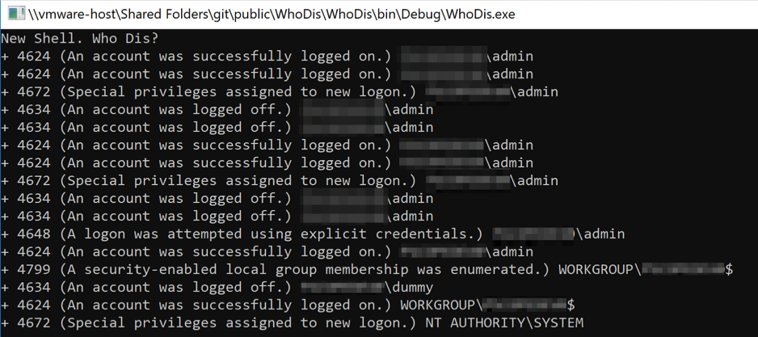

# New Shell, Who Dis?

Build in Visual Studio (.net 3.5 so it runs on Win 7). 

This is a proof of concept, example project that shows a pattern for how to leverage Windows Event Log listeners to collect security events, such as logon, logoff, and privilege use, programmatically from C#.

